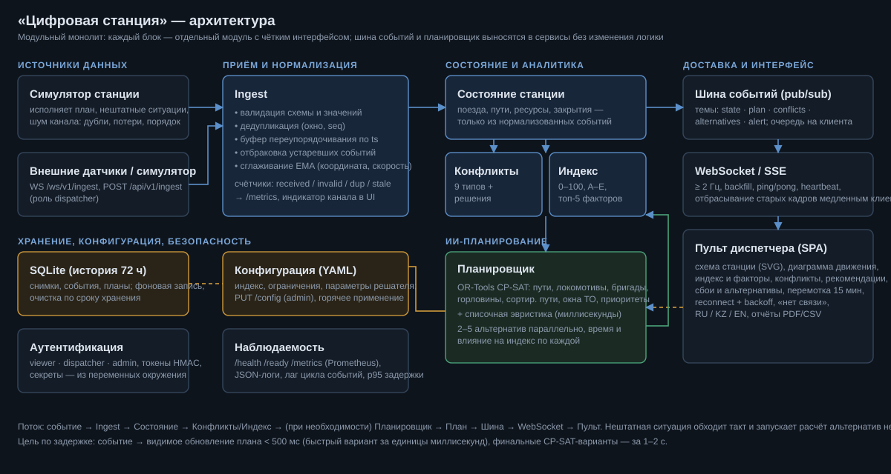

# «Цифровая станция» — интеллектуальная система планирования и оптимизации работы железнодорожной станции

Full-stack прототип (кейс хакатона): цифровая модель станции, ИИ-планирование (OR-Tools CP-SAT + эвристика), индекс эффективности с объяснением,
онлайн-поток по WebSocket/SSE, автоматическое перепланирование при нештатных ситуациях, перемотка, отчёты PDF/CSV.
Интерфейс RU / KZ / EN, тема «KTZ Executive Slate». Все данные синтетические.



## Быстрый старт

```bash
pip install -r requirements.txt
cd backend
python -m uvicorn main:app --host 127.0.0.1 --port 8000      # или run.bat / run.sh
```
→ **http://127.0.0.1:8000** (пульт диспетчера), **/docs** (OpenAPI/Swagger), **/metrics**, **/health**.
Docker: `cp .env.example .env && docker compose up --build` (`--profile demo` добавляет внешнего «датчика»; образ в этой среде не собирался — не проверено).

Вход (DEV-режим, если не заданы переменные окружения): `dispatcher / dispatcher`, `admin / admin`. В проде — `RAILTWIN_DEV=0` и `RAILTWIN_*_USER/PASSWORD/SECRET` (см. `.env.example`).

## Что реализовано по требованиям кейса

| Требование | Где |
|---|---|
| Цифровая модель инфраструктуры и занятость | `digital/infra.py`; схема станции (SVG) на пульте: пути, парки П/С/Пл, платформы, горловины, депо, окна ТО |
| ИИ/оптимизация, пересчёт плана | `digital/planner.py`: CP-SAT (пути, локомотивы, бригады, горловины, сортировочные пути, окна ТО, приоритеты) + эвристика |
| Конфликты и варианты разрешения | `digital/conflicts.py`: 9 типов, решения «в один клик» |
| Индекс эффективности (0–100, A–E), факторы | `digital/efficiency.py`: формула, веса, пороги, категории, топ-5 вкладов, окно «Формула» |
| Схема, диаграмма движения, узкие места, рекомендации | вкладка «Цифровая станция · пульт диспетчера» |
| Перепланирование при нештатных ситуациях | 7 видов, «без вмешательства» против 2–6 альтернатив: время расчёта и **влияние на индекс** |
| Поток ≥ 1 Гц по WebSocket/SSE (мок разрешён) | `/ws/v1/stream`, `/api/v1/stations/{id}/stream`; ≈ 2 Гц |
| Буферизация, сглаживание, дедупликация, валидация | `digital/ingest.py` (счётчики в UI и `/metrics`) |
| Reconnect, backoff, «нет связи» | `frontend/js/dash/stream.js` (WS → SSE, экспоненциальная задержка с джиттером, сторожевой таймер) |
| Отдельный модуль планирования, шина событий | `planner.py`; in-process pub/sub (темы state/plan/conflicts/alternatives/alert) |
| REST + WS, история 24–72 ч, конфигурация без перекомпиляции | `api.py`, `store.py` (SQLite, 72 ч), `config/default.yaml` + `PUT /api/v1/config` |
| Логи, метрики, health-check | JSON-логи, `/metrics` (Prometheus), `/health`, `/ready`, лаг цикла событий |
| Видимое обновление < 500 мс; пересчёт — секунды; всплески ×5–×10 | `tools/load_test.py`: быстрый план у клиента ≈ 0.1–0.2 с, финальные альтернативы 1–2 с, ≥ 2 кадра/с при 20 подписчиках |
| Базовая аутентификация, ограничение настроек | роли viewer / dispatcher / admin, токены HMAC |
| Перемотка 5–15 мин, отчёт PDF/CSV | ползунок внизу пульта; `/api/v1/stations/{id}/report.pdf|csv` |
| Документация API и архитектурная диаграмма | `/docs`, `docs/ARCHITECTURE.md`, `docs/architecture.svg` |
| Презентация, сценарий демо | `docs/PRESENTATION.md`, `docs/DEMO.md` |

## Публикация для жюри (Deploy)

Нужен хостинг с **долгоживущим процессом и WebSocket** — Vercel/Netlify (serverless) не подходят. Проверенные варианты, везде используется `Dockerfile`:

| Платформа | Как | Примечание |
|---|---|---|
| **Hugging Face Spaces** (рекомендуется) | New Space → SDK *Docker* → залить репозиторий; Settings → Variables/Secrets | 2 vCPU бесплатно, `app_port: 7860` уже в front-matter этого README; задать `PORT=7860` |
| **Render** | New → Blueprint → репозиторий (`render.yaml`) | free-план засыпает, CPU 0.5 |
| Fly.io / Railway | `fly launch` / «Deploy from repo» | порт берётся из `$PORT` |

Переменные окружения для публичного стенда (секреты — только через настройки хостинга):

```
RAILTWIN_DEV=0                 # без демо-учёток admin/admin
RAILTWIN_OPEN_DEMO=1           # открывший ссылку = диспетчер (может вносить нештатные ситуации); настройки — только admin
RAILTWIN_SECRET=<длинная случайная строка>
RAILTWIN_ADMIN_USER=admin
RAILTWIN_ADMIN_PASSWORD=<пароль>
RAILTWIN__planner__workers=2   # любой параметр YAML: RAILTWIN__<раздел>__<ключ>
```

SQLite на бесплатных хостах эфемерна (история сбрасывается при перезапуске) — для демо это допустимо.

## Проверка

```bash
python tests/run_all.py                # 21 тест: планировщик, ingest, индекс, конфигурация, API, WebSocket, нагрузка
python tools/load_test.py --clients 20 --bursts 3 --multiplier 10    # нагрузочный сценарий против запущенного сервера
python tools/ws_client_demo.py --station otar                        # внешний источник: дубли, мусор, перемешанный порядок
```

## Структура

```
backend/  main.py · digital/ (config, infra, timetable, simulator, ingest, state, planner, conflicts, efficiency, kpi, service, store, api, auth, metrics, reports)
          config/default.yaml · assets/fonts (DejaVu для PDF) · legacy: layout.py, stations.py, optimizer.py, disruption.py, safety.py …
frontend/ index.html · css/{app,dash}.css · js/dash/{dash,stream,scheme,diagram,indexw}.js · js/{app,i18n,map,scene3d,sim}.js
tools/    ws_client_demo.py · load_test.py        tests/  test_digital.py · test_api.py · run_all.py        docs/
```

## Дополнительные вкладки (ранее созданные модули)

«Сеть КТЖ» — карта Казахстана и тепловая карта загрузки участков; «Цифровой двойник станции» — 3D, IoT-датчики, CCTV-имитация, станционные сценарии
(башмак, враждебные маршруты, незакреплённый состав и др.), AnyLogic-эмуляция. Эти вкладки работают на собственной локальной симуляции и **не связаны** с потоком пульта диспетчера.

## Честные оговорки

* Данные, расписание и поведение станции — **синтетические**; симулятор — не реальная АСУ. Модель упрощена (две горловины, время в минутах).
* CP-SAT ограничен по времени: возвращается лучшее найденное решение (статус и bound — в `solver`), не всегда доказанный оптимум. «Быстрый» план — эвристика, его качество ниже на сложных сбоях.
* Шина событий — внутри процесса (интерфейсы изолированы, замена на Kafka/RabbitMQ не меняет доменную логику). Масштабирование по станциям — отдельным процессом на группу станций.
* Docker-образ не собирался и не запускался в этой среде; тесты и нагрузочный сценарий выполнялись локально на Windows (Python 3.10/3.13).
* AnyLogic Cloud, IoT и CCTV в дополнительных вкладках эмулируются.
