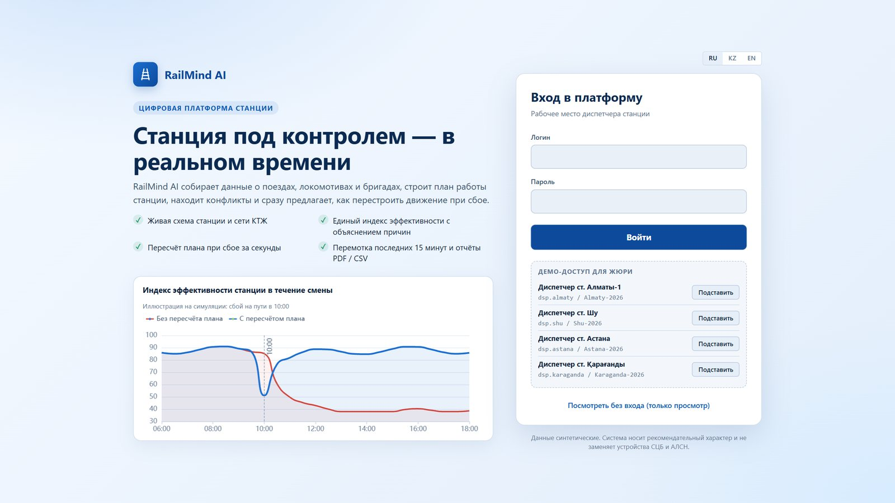
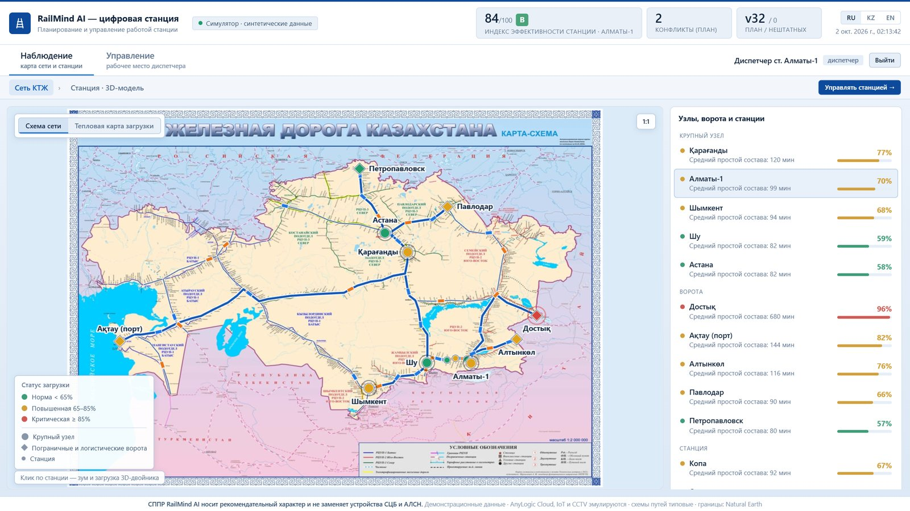
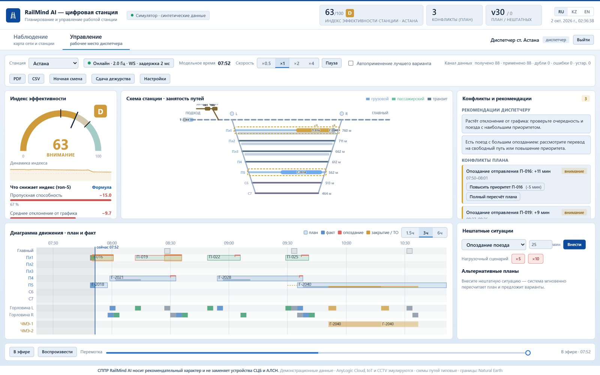

# RailMind AI — «Цифровая станция»

Интеллектуальная система планирования и управления работой железнодорожной станции (кейс хакатона «Цифровая станция»):
цифровая модель станции, планирование на OR-Tools CP-SAT с быстрой эвристикой, индекс эффективности с объяснением причин,
онлайн-поток по WebSocket/SSE, автоматический пересчёт плана при нештатных ситуациях, перемотка последних 15 минут, отчёты PDF/CSV.
Интерфейс на русском, казахском и английском. **Все данные синтетические.**

**Онлайн-стенд:** https://railtwin-digital-station.onrender.com
(бесплатный хостинг засыпает после 15 минут без запросов — первое открытие может занять около минуты)

| Демо-диспетчер | Логин / пароль | Станция |
|---|---|---|
| Алматы-1 | `dsp.almaty` / `Almaty-2026` | Алматы-1 |
| Шу | `dsp.shu` / `Shu-2026` | Шу |
| Астана | `dsp.astana` / `Astana-2026` | Астана |
| Қарағанды | `dsp.karaganda` / `Karaganda-2026` | Қарағанды |

Можно войти и без пароля (кнопка «Посмотреть без входа») — тогда только просмотр. Учётные записи синтетические, список лежит в
[`backend/config/demo_users.yaml`](backend/config/demo_users.yaml) и показан на экране входа.



## Что умеет система

- **Наблюдение** — карта сети КТЖ на фотографии карты-схемы (13 станций кейса с разными проблемами, тепловая карта загрузки участков, имитация движения поездов по всей сети) и 3D-модель любой станции (пути, поезда, IoT-датчики, видеонаблюдение). Только просмотр.
- **Управление** — рабочее место диспетчера: схема путей, диаграмма движения «план/факт», индекс эффективности и топ-5 причин потерь, конфликты и рекомендации, нештатные ситуации с альтернативными планами, перемотка 15 минут, сдача дежурства, отчёты PDF/CSV.
- **Безопасность** — блокировки (забытый башмак, враждебные маршруты, незакреплённый состав) со справочными ссылками на ИДП/ТРА, чек-лист сдачи дежурства со сверкой числа башмаков, ночной режим 00:00–06:00.
- Система носит **рекомендательный характер** (СППР) и не заменяет устройства СЦБ и АЛСН.




## Быстрый старт

```bash
pip install -r requirements.txt
cd backend
python -m uvicorn main:app --host 127.0.0.1 --port 8000      # или run.bat / run.sh
```

→ **http://127.0.0.1:8000** (интерфейс), **/docs** (OpenAPI/Swagger), **/metrics** (Prometheus), **/health**, **/ready**.

Без переменных окружения включается DEV-режим: помимо демо-диспетчеров доступны `dispatcher / dispatcher` и `admin / admin`
(в логах — предупреждение). Для прода задайте переменные из раздела «Конфигурация».

Docker: `cp .env.example .env && docker compose up --build` (`--profile demo` добавляет внешнего «датчика» для демонстрации приёма данных).

## Деплой (Render) — так опубликован онлайн-стенд

Нужен хостинг с **долгоживущим процессом и WebSocket**: Vercel/Netlify (serverless) не подходят, потому что поток данных и цикл симуляции работают постоянно.
Стенд опубликован на [Render](https://render.com) как Docker-сервис из этого репозитория.

**Как это сделано**

1. Репозиторий: https://github.com/MFDoom151/railmindai, ветка `main`.
2. Render → **New → Blueprint** → выбран репозиторий → Render читает [`render.yaml`](render.yaml) (тип `web`, runtime `docker`, план `free`, health check `/health`) и собирает образ из [`Dockerfile`](Dockerfile).
3. Переменные окружения заданы в `render.yaml`; секретные значения (`RAILTWIN_SECRET`, `RAILTWIN_ADMIN_PASSWORD`) Render генерирует сам (Dashboard → сервис → Environment).
4. **Автодеплой:** каждый `git push origin main` пересобирает и перезапускает сервис (≈ 4–6 минут).
5. Порт передаётся хостингом в `$PORT`, Dockerfile его читает; процесс запускается не от root.

**Особенности бесплатного плана**

- сервис засыпает после 15 минут без запросов, первое открытие после сна — до минуты (откройте стенд заранее);
- 0,5 vCPU: решатель CP-SAT считает медленнее, чем на ноутбуке (параметр `RAILTWIN__planner__workers=2`);
- диск эфемерный: история SQLite и переопределения настроек сбрасываются при перезапуске — для демо допустимо.

**Свой стенд**

1. Fork/clone репозитория → Render → New → Blueprint (или New → Web Service → Language: Docker, Health Check Path `/health`).
2. Задайте переменные окружения (таблица ниже).
3. Другие хостинги: Fly.io и Railway работают так же (Docker, порт из `$PORT`). Hugging Face Spaces (Docker SDK) тоже подойдёт: добавьте в начало `README.md` front-matter `sdk: docker` и `app_port: 7860`, задайте `PORT=7860`; на новых аккаунтах бесплатная квота CPU может быть нулевой.

## Конфигурация (переменные окружения)

Секреты — **только** через переменные окружения (в репозиторий они не попадают).

| Переменная | Значение |
|---|---|
| `RAILTWIN_DEV` | `0` — отключить DEV-учётки `admin/admin` и `dispatcher/dispatcher` (обязательно для публичного стенда) |
| `RAILTWIN_SECRET` | ключ подписи токенов (длинная случайная строка) |
| `RAILTWIN_ADMIN_USER` / `RAILTWIN_ADMIN_PASSWORD` | администратор (меняет веса индекса, параметры решателя) |
| `RAILTWIN_DISPATCHERS` | личные рабочие места: `логин:пароль:станция:Имя;логин2:пароль2:станция2:Имя2` |
| `RAILTWIN_DEMO_USERS` | `0` — отключить демо-диспетчеров из `backend/config/demo_users.yaml` (по умолчанию включены) |
| `RAILTWIN_OPEN_DEMO` | `1` — посетитель без входа получает роль диспетчера (по умолчанию `0`: без входа только просмотр) |
| `RAILTWIN__<раздел>__<ключ>` | любой параметр из `backend/config/default.yaml`, например `RAILTWIN__planner__workers=2` |
| `RAILTWIN_DB_PATH`, `RAILTWIN_CONFIG`, `RAILTWIN_CONFIG_OVERRIDE` | пути к базе и файлам конфигурации |

Параметры индекса и планировщика также меняются на лету: `PUT /api/v1/config` (роль admin) или окно «Настройки».

## Что реализовано по требованиям кейса

| Требование | Где |
|---|---|
| Цифровая модель инфраструктуры и занятость | `digital/infra.py`; схема станции (SVG): пути, парки, платформы, горловины, депо, окна ТО |
| Оптимизация, пересчёт плана | `digital/planner.py`: CP-SAT (пути, локомотивы, бригады, горловины, сортировочные пути, окна ТО, приоритеты) + эвристика |
| Конфликты и варианты разрешения | `digital/conflicts.py`: 9 типов, решения «в один клик» |
| Индекс эффективности (0–100, A–E), факторы | `digital/efficiency.py`: формула, веса, пороги, топ-5 вкладов, окно «Формула» |
| Схема, диаграмма движения, узкие места, рекомендации | вкладка «Управление» |
| Перепланирование при нештатных ситуациях | 7 видов сбоев; «без вмешательства» против альтернатив: время расчёта и влияние на индекс |
| Поток ≥ 1 Гц по WebSocket/SSE | `/ws/v1/stream`, `/api/v1/stations/{id}/stream`; ≈ 2 Гц |
| Буферизация, сглаживание, дедупликация, валидация | `digital/ingest.py` (счётчики в интерфейсе и `/metrics`) |
| Reconnect, backoff, «нет связи» | `frontend/js/dash/stream.js` (WS → SSE, экспоненциальная задержка с джиттером) |
| REST + WS, история 72 ч, конфигурация без перекомпиляции | `api.py`, `store.py` (SQLite), `config/default.yaml` + `PUT /api/v1/config` |
| Логи, метрики, health-check | JSON-логи, `/metrics` (Prometheus), `/health`, `/ready` |
| Роли и аутентификация | viewer / dispatcher / admin, токены HMAC, личные аккаунты диспетчеров |
| Перемотка 5–15 мин, отчёт PDF/CSV | ползунок внизу «Управления»; `/api/v1/stations/{id}/report.pdf` и `.csv` |
| Сдача дежурства, ночной режим | `POST /api/v1/stations/{id}/handover`; окно «Сдача дежурства» |
| Документация, презентация, сценарий демо | `/docs`, [`docs/ARCHITECTURE.md`](docs/ARCHITECTURE.md), [`docs/DEMO.md`](docs/DEMO.md), [`docs/presentation/`](docs/presentation) |

## Проверка

```bash
python tests/run_all.py                # 25 тестов: планировщик, ingest, индекс, конфигурация, API, роли, сдача дежурства, WebSocket
python tools/load_test.py --clients 20 --bursts 3 --multiplier 10    # нагрузочный сценарий против запущенного сервера
python tools/ws_client_demo.py --station otar                        # внешний источник: дубли, мусор, перемешанный порядок
```

Замеры на синтетических данных: поток ≈ 2,5 кадра/с на онлайн-стенде; приём нештатной ситуации ≈ 1 мс; в сценарии из трёх сбоев на Астане
прогнозный индекс плана вырос с 60,5 до 86,2, расчёт альтернатив занял около 40 мс (ноутбук разработчика). Это прогноз выбранного плана на симуляции,
а не измеренный эффект на реальной станции.

## Структура

```
backend/   main.py · digital/ (config, infra, timetable, simulator, ingest, state, planner, conflicts, efficiency, kpi, service, store, api, auth, metrics, reports)
           config/{default.yaml, demo_users.yaml} · assets/fonts (DejaVu для PDF) · stations.py, layout.py, safety.py, disruption.py …
frontend/  index.html · css/{app,dash,light}.css · img/kz-rail-map.jpg
           js/{app,i18n,map,netdata,scene3d,sim}.js · js/dash/{dash,stream,scheme,diagram,indexw}.js
tools/     ws_client_demo.py · load_test.py        tests/  test_digital.py · test_api.py · run_all.py
docs/      ARCHITECTURE.md · DEMO.md · PRESENTATION.md · presentation/ (KZ, RU) · img/        Dockerfile · render.yaml · docker-compose.yml
```

## Честные оговорки

- Данные, расписание и поведение станции **синтетические**; симулятор — не реальная АСУ. Модель упрощена (две горловины, время в минутах).
- Экономический эффект на реальных данных **не измерен** — его покажет пилот. Процентов улучшения в проекте нет намеренно.
- CP-SAT ограничен по времени и возвращает лучшее найденное решение, не всегда доказанный оптимум. «Быстрый» план — эвристика.
- Шина событий внутри процесса; масштабирование по станциям — отдельным процессом на группу станций.
- Карта сети — фотография карты-схемы; трассы и положение станций сняты с неё вручную и приблизительны. Остальная сеть — имитация движения.
- Ссылки на ИДП/ТРА в сообщениях безопасности взяты из материалов актов расследования и **требуют сверки** с действующей редакцией документов.
- AnyLogic Cloud, IoT и CCTV эмулируются.
- Docker-образ собирается и работает на Render; локально через `docker compose` в этой среде не запускался.
